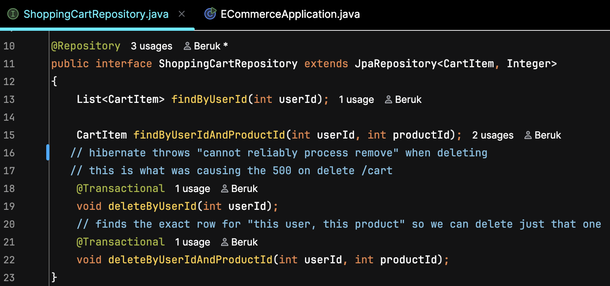

# Beruk's Playlist
#### A Record Store e-commerce API and storefront built on Spring Boot, MySQL, and vanilla JavaScript.

## How to Run
1. Clone the repo from GitHub
2. Open the project in IntelliJ IDEA
3. Open `database/create_database_recordshop.sql` in MySQL Workbench and run it to create the database
4. Run `ECommerceApplication.java`
5. Open `index.html` through a local server (or IntelliJ's built in browser launch) so the JavaScript can actually talk to the API
6. Log in with one of the demo accounts (`user`, `admin`, or `george`, password is `password` for all three) to unlock cart, profile, and checkout


## The Design Process
I went with the Record Store option because I'm a music guy through and through, rap, house, alternative, classic country, all of it, so building a storefront I'd actually want to shop on made the whole thing more fun to work on.

I followed the layered pattern the starter code already used instead of inventing my own structure: Controller handles the HTTP stuff and role checks, Service holds the actual business logic, Repository talks to MySQL through JPA. Once I built Categories that way in Phase 1, every other phase (Cart, Profile, Checkout) was really just the same shape with different fields. Consistency made the codebase feel like one person wrote it instead of five different patterns bolted together.


For planning and tracking the actual work, I used GitHub's built in Project board instead of Trello, which is what I was used to. The Team Items tab, the spreadsheet style table view of every card, ended up being where I actually managed everything day to day, it's faster to scan and edit than dragging cards around. The Kanban board view itself, though, I liked less than Trello's. It felt more spaced out than it needed to be, and color coding statuses wasn't nearly as intuitive, on Trello you just click a color and you're done, GitHub buries that option a few clicks deeper than I expected.

Once the API was solid, I leaned into the demo side hard. I gave the whole site a Miami Vice inspired 90s look, dark purple header, neon green prices, hot pink buttons, swapped in retro Google Fonts, and built a custom logo. I also added a Posters category with tribute pieces for Daft Punk, A$AP Rocky (my favorite artist), and Nipsey Hussle (RIP), reusing the exact same product/photo system as every other item instead of writing special case code for them.

While I was in the database anyway, I cleaned up a few things I noticed along the way. The seed data had a stray Smartphone product that obviously didn't belong in a record store, so I added a real `active` boolean column to the products table and a single filter line in `ProductService.search()`, instead of just deleting the row, which let me hide it from the storefront while keeping it intact in the database (this is also a decsion that will come in handy in the future). I also caught two turntables that had identical names but different descriptions, so I renamed them so they're actually distinguishable in the listing.


Also created another category! Whats a record shop with out posters for sale right? However if you run some of the insomia yamma file tests, a few will fail becuase of this... (more on this latter)

## Interesting Code
The most interesting piece of code is one annotation I had to learn the hard way, then apply on purpose the second time. When I built the Clear Cart endpoint, calling `DELETE /cart` kept throwing a 500 instead of clearing anything:

```java
void deleteByUserId(int userId);
```

The stack trace actually told me almost exactly what was wrong: `No EntityManager with actual transaction available for current thread, cannot reliably process 'remove' call`. Spring Data's built in methods like the regular `deleteById()` already come with transaction handling baked into the library itself, but the moment I wrote a custom derived delete method of my own, that automatic behavior disappeared. The fix was one line:

```java
@Transactional
void deleteByUserId(int userId);
```

A transaction is just a boundary around a unit of work, everything inside it either fully happens or fully rolls back. Hibernate doesn't send SQL to the database the instant you call a method, it stages changes and needs a transaction to know when to actually commit them. Without one, it had nowhere to flush that delete to.

The part I'm actually proud of is what happened next. When I built the Remove Single Item feature later, I added a second custom delete method, `deleteByUserIdAndProductId`, and I put `@Transactional` on it from the start, no crash needed to teach me twice:

```java
@Transactional
void deleteByUserIdAndProductId(int userId, int productId);
```
fun fact, this is the backend of what removes an indivual product from it's cart 

`@Transactional` is the only two custom delete methods I ever wrote. Every other delete in the app just uses the inherited `deleteById()`, which already handles this for me. Knowing exactly when a rule applies, and when it doesn't, felt like a bigger win than just memorizing the annotation.



## Biggest Challenge
Honestly, the GitHub setup was supringsly difficult. I hit a Personal Access Token error, fixed it, hit a different scope error, fixed that, then discovered I'd been about to commit my frontend code into the wrong repo entirely. None of that was in the capstone doc, it was just real developer life, and I came out the other side having a deeper understanding of tokens, scopes, and how GitHub Actions auto-creates issues instead of just copy-pasting commands I didn't get.

The other one that got me was a single missing letter. I added a Remove button to the shopping cart and typed `document.createdElement` instead of `createElement`. One extra letter, one stray bracket on top of it, and it litteraly broke every cart feature on the entire page, (for like 2 hours I thoguht I was cooked) View Cart, the cart icon, Add to Cart, all of it, with zero error message visible anywhere on the page itself. That's when I actually learned to open the browser console instead of just guessing, since the console showed exactly which line and what was wrong the whole time... use the console more!!

I also had to make a call when adding a custom Posters category broke one of the official Insomnia tests, since it was hardcoded to expect exactly 3 categories. I messaged Gregor, explained the four categories were correct, the test was just written before I customized anything, and he approved leaving it as is. Knowing when a failing test means your code is wrong versus when it just means your data changed turned out to be its own kind of skill.

## What I Learned
I learned how JWT actually works end to end instead of just trusting it as magic, login issues a signed token, the client carries it around, and a filter checks it on every single request before anything else even runs.

I also helped a few classmate out on some parts of this project and one that stands out was a debug issue where they has a duplicate `@PutMapping` in their own Categories controller, which ended up teaching me more about Spring's route mapping than just reading my own code ever did, explaining a bug out loud forces you to actually understand it.

## Future Versions
If I kept building this out, in order of priority:
1. A real product visibility flag used the way it's meant to, hiding seasonal or discontinued items, not just the one stray Smartphone that snuck into the seed data
2. Dark mode as a real toggle instead of just my one fixed retro theme
3. A full custom album catalog, so it's actually "my playlist" 30 to 50 real albums replacing the generic CD inventory
4. Audio samples on every product!

## Thank you!
